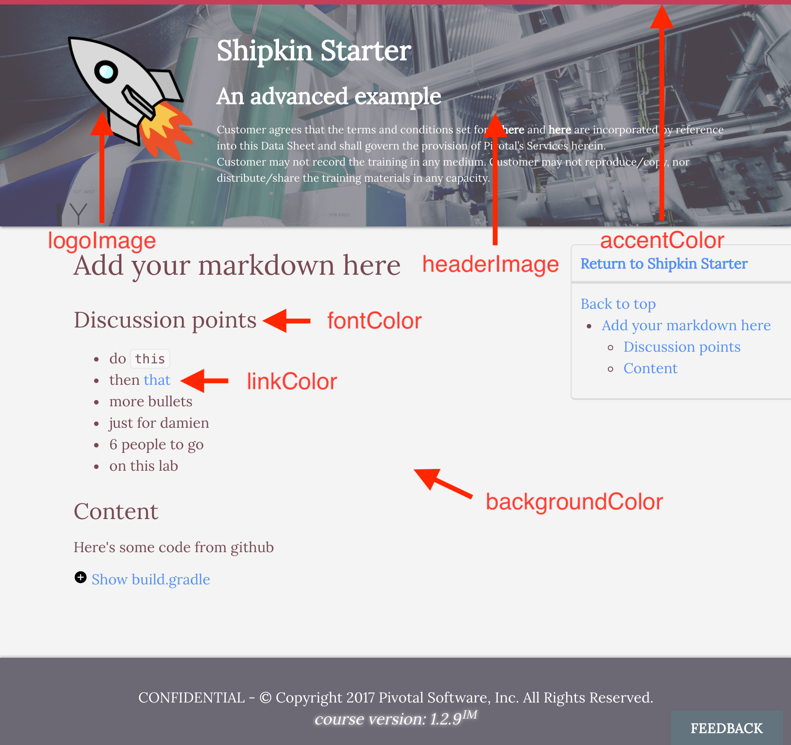

# Theme parameters

You can add parameters to the `theme` configuration within the `shipkin`
closure in your `build.gradle` file to customize your course.

{{codebase-file codebase="shipkin-course" path="courses/shipkin/build.gradle" lang="groovy" ref="master" hidden="true"}}

There are four required parameters:

1.  `mainColor` is the color of the site header and footer.
1.  `linkColor` is the color of all links.
1.  `accentColor` is the color of the thin border at the top of the
    header.
1.  `favicon` is the site's favicon.

There are also several optional parameters:

1.  `backgroundColor` controls the background of the `body` element.
1.  `headerImage` is the background image of the main header.
1.  `slideImage` sets an image in the top-left corner of each slide.
1.  `logoImage` adds a logo to the header.

You can configure the font `font` closure within the `theme` closure.
The following options are available: 

1.  `color` changes the font color.
1.  `family` changes the font family.
1.  `url` allows loading of the font family from a remote URL (a Google
    Fonts URL, for example).

_The below image shows where the theme parameters take effect on the
rendered page._

# Custom theme files

You may include a custom header which will replace the default header.
To do so, add a `theme/header.ftl` file to your `courses/[course-name]`
folder and create your header as a freemarker template.
Your header will have access to the following model variables:

-   `title` is a non-null string containing the course title.
-   `pageTitle` is a nullable string containing the page title.
-   `rootPath` is a non-null string containing the root path for assets.
    This must be used to load any assets, such as images.

You may also include a custom stylesheet.
To do so, add a `theme/custom.css` file to your `courses/[course-name]`
folder.
We discourage using the `custom.css` to style anything other than the
course header and basic document styles, as future updates to Shipkin
may break your overrides.

To change fonts use the [theme parameters](#theme-parameters).